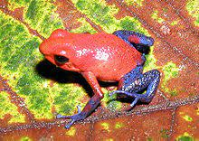

## Predicting Frog Toxicity 
The data is from this [research paper](https://zenodo.org/records/5010072#.Y2bE9HbP1D_)  
### Data from: Poision frog colors are honest signals of toxicity, particularly bird predators  

This research delves into the intricate relationship between antipredator defenses and warning signals within the context of the color polymorphic strawberry poison frog, Dendrobates pumilio. The study reveals substantial variation in toxicity levels across different frog populations and establishes a positive correlation between frog coloration brightness, indicative of visual conspicuousness, and toxicity. This suggests that the vibrancy of coloration may serve as an honest signal of prey unpalatability, particularly influencing bird predators. By employing taxon-specific visual detection models, the research further explores the predator-specific relationships, highlighting strong positive correlations between toxicity and conspicuousness for bird perception. Weaker but still positive correlations are found for crab and conspecific frog perception, while snake perception shows no connection to toxicity levels. These findings provide valuable insights into the evolutionary dynamics of aposematic signal design, indicating potential selection pressures from specific predator types on the poison frog's warning signals.

These are the features we are working with.   
- **pop:** Abbreviation indicating the color morph of the specimen.

- **n_tox:** Number of frog individuals contributing to the toxicity estimate.

- **toxicity:** Estimate of toxicity.

- **viewer:** Observer responsible for assessing brightness metrics (pumilio, bird, crab, or snake).

- **background:** Background against which luminance metrics are recorded (bark, heli (Heliconia), or leaf (leaf litter)).

- **noise:** Processing methods employed to manage receptor noise during metric recording.

- **v_or_d:** Reflectance recorded from the ventral or dorsal side.

- **vs_lumin_cont:** Viewer-specific luminance (brightness) contrast.

- **vs_chrom_cont:** Viewer-specific chromatic (color) contrast.

- **vs_conspic:** Viewer-specific conspicuousness, incorporating both luminance and color contrast.

- **vi_brightness:** Viewer-independent brightness, representing total reflectance.

#### Hyperparameter Tuning in XGBoost

XGBoost boasts a multitude of hyperparameters crucial for achieving optimal model performance. Typically, tuning involves defining a range of values for these parameters and employing a tuning tool to iteratively train models with different configurations, ultimately identifying the most effective combination. Given the time and resource-intensive nature of this process, we have pre-determined the optimal hyperparameters for this project.

**Hyperparameters to be Tuned:**

- **colsample_bytree:** The subsample ratio of columns when constructing each tree.
- **eval_metric:** The evaluation metric for validation data.
- **learning_rate:** Step size shrinkage used to prevent overfitting.
- **max_depth:** Maximum depth of a decision tree.
- **min_child_weight:** Minimum sum of instance weight needed in a child.
- **objective:** The loss function that XGBoost aims to minimize during training.
- **random_state:** Random number seed.

#### Model Export

The final step in our model development process involves saving and exporting the trained model, allowing it to be utilized beyond the training environment. For this project, we will export the model in the ONNX format—an open-source standard for representing machine learning models. Known for its lightweight structure, robustness, and fast inference speeds, ONNX ensures cross-platform compatibility. To facilitate the export, it is essential to specify the expected input format for the ONNX model converter. Additionally, the model's features must be renamed to a format supported by the converter.
