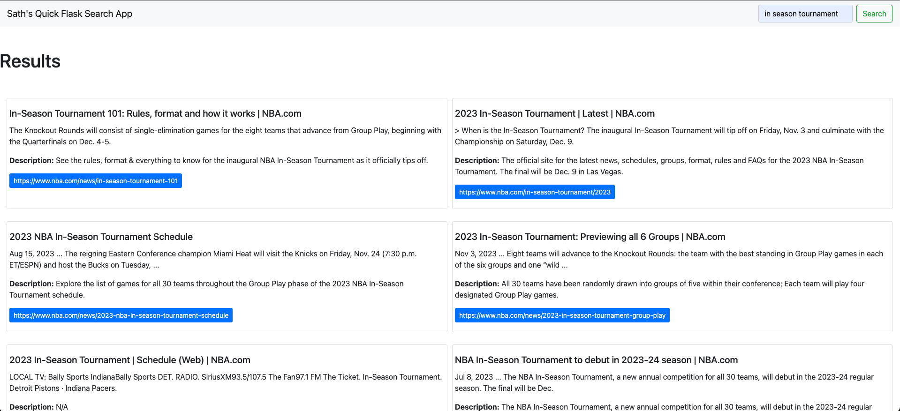

### Dynamic E-Learning Platform with Flask
The platform boasts a comprehensive course catalog featuring titles, images, authors, descriptions, and "Visit Website" buttons for each course. The user-friendly design allows seamless navigation, and a search bar facilitates easy exploration of available courses. Dive into the development process, starting with the course catalog implementation, data retrieval from seeds into the SQLAlchemy database, and loading into active records. The final touch includes adding a smart search feature, enabling users to find relevant courses effortlessly.

### Google Search Engine Integration with Flask Web App
Harness the power of Google's search technology seamlessly integrated into a Flask web application. Eliminate the need to implement search functionality from scratch and gain the flexibility to customize search results. Users input a search term, and the Google Search Engine API fetches active records, showcasing details like title, description, snippet, and URL on the website. The step-by-step project development includes building a model for result storage, creating an intuitive layout design, and implementing efficient search functionality.

