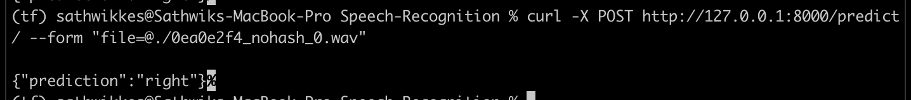

## Speech Recognition 

### Background

Automatic Speech Recognition (ASR) is a multidisciplinary field that merges signal processing with natural language processing, aiming to transcribe spoken language into textual form. Its applications range from virtual speech assistants like Siri to caption generation for platforms such as YouTube.

Developers often encounter ambiguity regarding the role of Natural Language Processing (NLP) models within the ASR pipeline. Beyond their application in language models, NLP plays a crucial role in enhancing generated transcripts with punctuation and capitalization at the end of the ASR pipeline.

After postprocessing the transcript, the text becomes a valuable resource for downstream language modeling tasks, including sentiment analysis, text analytics, summarization, question answering, and speech recognition algorithms.

Traditional ASR algorithms such as Hidden Markov Models (HMM) and Dynamic Time Warping (DTW) coexist with modern deep learning ASR algorithms like Quartznet, Citrinet, and Conformer.

### ASR Pipeline Components

An ASR pipeline comprises several components:
1. **Spectrogram Generator:** Converts raw audio to spectrograms.
2. **Acoustic Model:** Processes spectrograms, generating a matrix of probabilities over characters and time.
3. **Decoder:** Optionally coupled with a language model, generates possible sentences from the probability matrix.
4. **Punctuation and Capitalization Model:** Formats generated text for human consumption.

A typical deep learning pipeline includes data preprocessing, a neural acoustic model, a decoder (optionally coupled with an n-gram language model), and a punctuation and capitalization model.

### Loading the Training Dataset

For this project, we use the Speech Commands dataset, an audio dataset designed for training and evaluating keyword-spotting systems. This dataset, available in the TensorFlow datasets module, contains 105,829 utterances of 35 words.

### Understanding Spectrograms

A spectrogram visually represents signal strength over time at various frequencies in a waveform. It serves as a crucial input to the neural network, transforming the ASR task into a computer vision challenge. The `tf.signal.stft()` method in TensorFlow performs a short-time Fourier transform (STFT), splitting the signal into time windows and returning a two-dimensional tensor for convolution operations.

### Model Building

We approach audio feature extraction as a computer vision problem, employing a simple convolutional neural network with layers including resizing, normalization, convolution, max pooling, dropout, flattening, and dense layers. These layers are stacked into a Sequential model.

### Learning Curve Analysis

Plotting the learning curve aids in assessing the model's progress during training. Decreasing training and evaluation losses and increasing accuracies indicate successful learning.

### Confusion Matrix

A confusion matrix summarizes correct and incorrect predictions made by a classification model. It displays true positive, true negative, false positive, and false negative values, providing insights into model performance.

### Preprocessing Function Setup

Before inference, a preprocessing function is essential for reshaping the tensor, reading `.wav` files, squeezing input axes, adding a new axis, calculating the spectrogram, determining the index of the maximum probability element, and returning results. These preprocessing steps ensure seamless model utilization.

Sure, here's a reworded version for your README in Markdown format:

## Deploying the ASR Model as an API using FastAPI

To expose your Automatic Speech Recognition (ASR) model as an API, you will utilize FastAPI, a powerful framework for building APIs. Follow these steps to deploy your model and interact with it via API:

### 1. Code Organization

Ensure your ASR model code is organized in a `.py` file. This file will serve as the entry point for your FastAPI application.

### 2. Running the FastAPI Application

Navigate to the directory with flask app in your terminal, then execute the following command:

```bash
uvicorn app:app --reload
```

This command launches the FastAPI application, making your ASR model accessible through the specified endpoint.

### 3. Sending Requests to the Model

To send a request to the deployed model, open a new terminal and use the following `curl` command:

```bash
curl -X POST http://127.0.0.1:8000/predict/ --form 'file=@"/usercode/0ea0e2f4_nohash_0.wav"'
```

Replace `"0ea0e2f4_nohash_0.wav"` with the filename of the audio you want to process. This command simulates a POST request to the `/predict/` endpoint, providing the audio file for ASR processing.


Sample output:  
